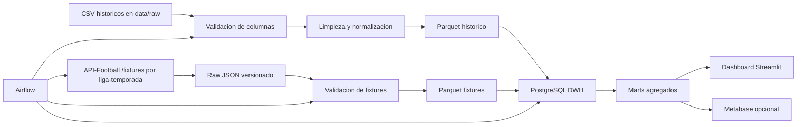

# Arquitectura del proyecto

## Objetivo

Construir un pipeline ETL y una aplicacion web de analisis estadistico deportivo que ayuden a comparar equipos, jugadores y arbitros a partir de datos historicos y fixtures futuros. El sistema no realiza apuestas ni garantiza resultados: muestra indicadores para apoyar decisiones.

## Decision tecnica

El dashboard se mantiene en Streamlit porque ya resuelve la visualizacion y las metricas del dominio. La arquitectura se completa con Apache Airflow, PostgreSQL DWH y Metabase opcional, siguiendo el proyecto ejemplo enviado por los profesores.

## Flujo de datos objetivo



## Capas del repo

- `data/raw`: CSV originales descargados desde Drive.
- `data/raw/api_football/fixtures`: respuestas JSON originales de API-Football.
- `data/interim`: datos temporales de exploracion o limpieza.
- `data/interim/quality_reports`: reportes de calidad del pipeline.
- `data/interim/request_logs`: registro de requests a API-Football.
- `data/processed/parquet`: tablas convertidas a Parquet por chunks.
- `data/marts`: tablas finales ya agregadas para dashboards.
- `dags`: DAGs de Airflow.
- `db`: scripts SQL del Data Warehouse.
- `src/sports_analytics/etl`: validacion y transformacion de datos.
- `src/sports_analytics/ingestion`: ingesta de fuentes externas.
- `src/sports_analytics/metrics`: calculo de KPIs.
- `src/sports_analytics/storage`: abstraccion para storage externo.
- `src/sports_analytics/services`: lectura de datos para la app.
- `app`: interfaz Streamlit.
- `docs`: documentacion SRS/PGP, pipeline y decisiones tecnicas.

## API-Football

La ingesta se realiza por liga y temporada para minimizar requests:

```text
/fixtures?league=<league_id>&season=<season>&next=<n>
```

La app puede consultar la API manualmente como respaldo, pero la fuente principal son los fixtures ya procesados por Airflow o por `scripts/sync_api_football_fixtures.py`.

## Airflow

El DAG `football_analytics_pipeline` implementa:

```text
validate_dwh + validate_config
  -> fetch_api_football_fixtures
  -> validate_fixtures_schema
  -> normalize_fixtures_to_parquet
  -> load_fixtures_to_dwh
  -> build_fixture_marts
  -> quality_check
```

Airflow se encarga de scheduling, dependencias, retries, logs y monitoreo.

## Data Warehouse

PostgreSQL contiene:

- `stg_api_football_fixtures`: detalle normalizado de fixtures.
- `etl_request_log`: auditoria de llamadas a API-Football.
- `mart_upcoming_fixtures`: tabla lista para dashboard/BI.
- `mart_fixture_quality_summary`: resumen historico de calidad.

## Por que chunks

Un chunk es un bloque de filas. En vez de cargar un CSV completo de 300 MB en memoria, pandas puede leerlo por partes:

```python
pd.read_csv("data/raw/game_lineups.csv", chunksize=250_000)
```

Cada bloque se procesa y se guarda en Parquet. Asi se evita saturar memoria y despues la app lee un formato mas rapido que CSV.

## Por que Parquet

Parquet es un formato columnar y comprimido. Para este proyecto sirve porque:

- ocupa menos espacio que CSV;
- permite leer solo columnas necesarias;
- conserva tipos de datos mejor que CSV;
- acelera consultas repetidas en dashboards.

## Limpieza y trazabilidad

La normalizacion vive en `src/sports_analytics/etl/normalize.py`. Convierte fechas, numeros y booleanos, limpia espacios en textos y evita valores negativos en metricas deportivas basicas. La deteccion de problemas vive en `src/sports_analytics/etl/quality.py`: reporta nulos, duplicados e inconsistencias sin borrar informacion silenciosamente.

Cuando se genera Parquet de CSV historicos, se agregan columnas `_source_table`, `_source_file` y `_source_chunk`. Para fixtures externos se conservan `source_endpoint`, `source_params` e `ingested_at`.

## Requisitos

La trazabilidad entre SRS/PGP y codigo esta documentada en `docs/matriz_requisitos.md`.
