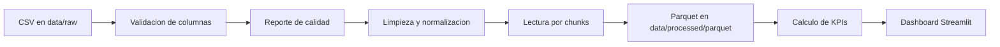

# Arquitectura inicial

## Objetivo

Construir una aplicacion web de analisis estadistico deportivo que ayude a comparar equipos, jugadores y arbitros a partir de datos historicos. El sistema no realiza apuestas ni garantiza resultados: muestra indicadores para apoyar decisiones.

## Decision tecnica inicial

Para una primera version conviene usar Streamlit. Permite llegar rapido a un dashboard funcional con Python, pandas y Plotly. Si mas adelante necesitan una interfaz mas personalizada, el pipeline de datos y las metricas pueden reutilizarse desde una app HTML/React.

## Flujo de datos



## Capas del repo

- `data/raw`: CSV originales descargados desde Drive.
- `data/interim`: datos temporales de exploracion o limpieza.
- `data/processed/parquet`: tablas convertidas a Parquet por chunks.
- `data/marts`: tablas finales ya agregadas para dashboards.
- `src/sports_analytics/etl`: validacion y transformacion de datos.
- `src/sports_analytics/metrics`: calculo de KPIs.
- `src/sports_analytics/services`: lectura de datos para la app.
- `app`: interfaz Streamlit.
- `docs`: documentacion SRS/PGP, pipeline y decisiones tecnicas.

## Por que chunks

Un chunk es un bloque de filas. En vez de cargar un CSV completo de 300 MB en memoria, pandas puede leerlo por partes:

```python
pd.read_csv("data/raw/game_lineups.csv", chunksize=250_000)
```

Cada bloque se procesa y se guarda en Parquet. Asi se evita saturar memoria y despues la app lee un formato mas rapido que CSV.

## Por que Parquet

Parquet es un formato columnar y comprimido. Para este proyecto sirve porque:

- ocupa menos espacio que CSV;
- permite leer solo columnas necesarias;
- conserva tipos de datos mejor que CSV;
- acelera consultas repetidas en dashboards.

## Limpieza y trazabilidad

La normalizacion vive en `src/sports_analytics/etl/normalize.py`. Convierte fechas, numeros y booleanos, limpia espacios en textos y evita valores negativos en metricas deportivas basicas. La deteccion de problemas vive en `src/sports_analytics/etl/quality.py`: reporta nulos, duplicados e inconsistencias sin borrar informacion silenciosamente.

Cuando se genera Parquet, se agregan columnas `_source_table`, `_source_file` y `_source_chunk`. Eso permite explicar de que tabla y archivo original salio cada bloque procesado.

## Requisitos

La trazabilidad entre SRS/PGP y codigo esta documentada en `docs/matriz_requisitos.md`.
